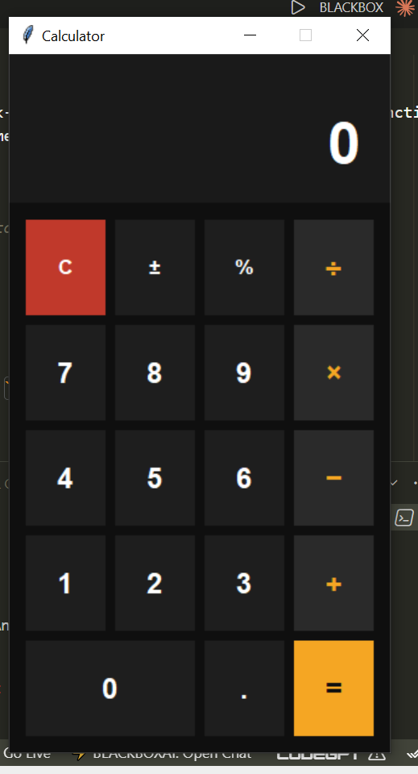
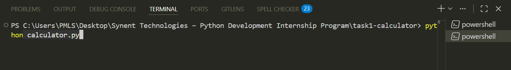
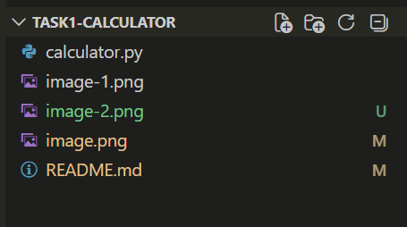

# CLI Calculator — Tkinter GUI

A desktop calculator built with Python and Tkinter. Dark-themed, keyboard-supported, and fully functional. Built as part of the Synent Technologies Python Development Internship.

## Preview

## Features

- Addition, subtraction, multiplication, division
- Percentage (`%`) and sign toggle (`±`)
- Live expression shown above the result
- Keyboard support (`0–9`, `+`, `-`, `*`, `/`, `Enter`, `Backspace`, `Esc`)
- Division by zero handled gracefully
- Hover effects on all buttons
- Window auto-centres on launch

## How to Run

No external libraries required — Tkinter ships with Python.

Requires Python 3.6+

## Project Structure

## What I Learned

- Building GUI layouts with Tkinter's grid system
- Managing application state with instance variables
- Parsing and evaluating math expressions safely
- Handling edge cases (double decimal, divide by zero, sign toggle)
- Binding keyboard events to GUI actions

## Author

**[Sehar Andleeb]**
Undergraduate AI Engineer @UOK
Python Development Intern at **Synent Technologies**